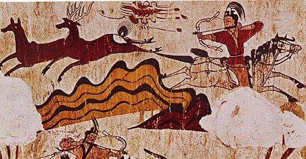

History is about memory, which has 3 main forms :\

-   **biological  :** inherited from your ancestors and stored into DNA.
-   **sensitive :** made of experiences from your own life which is
    stored in your organs (brain, nerves, etc.)
-   **social** : composite of human experiences from the past stored in
    technological objects (hammer, books, computers, etc.)

\
Science is investigating and documenting the formation of those
memories, while technology eventually provide knowledge and know-how
transfer to a larger population. Technology is just an enclosed form of
history - a laser cutter is an advanced biface silex after all.
Challenges face by humans everyday are just repetitions because we all
die without passing on much to others.\
\
To answer your question, history still relevant because it is the sum of
all existing human and natural processes.\
\
\

