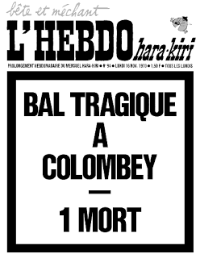

The journal was given this nickname as a joke about Charles de Gaulle,
who was president in France at the time (source : [Wolinski -
RIP](https://fr.wikipedia.org/wiki/Hara-Kiri_(journal)#La_rel.C3.A8ve_imm.C3.A9diate)
in  [L\'Écho des
savanes](https://en.wikipedia.org/wiki/L'%C3%89cho_des_savanes) no
239)). *Charlie Hebdo* was born in the 70s as a spin-off of a a monthly
publication called *Charlie* that focused mostly on comics. At that
time, another satirical journal called *Hara Kiri* was shutdown by
French government after making jokes about the death of the General de
Gaulle in his headline. Both team get together and decided to start a
weekly magazine mixing satire, comics and cartoons called *Charlie
Hebdo* (*hebdo* means weekly in French).\
\
Image : The famous cover that ended *Hara-Kiri* and therefore started
*Charlie Hebdo *\
* *\

