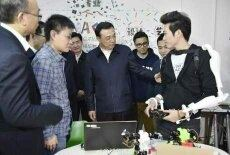

I think it has to do with an attempt to turn \"made in China\" into a
respectable brand. Recently, premier Li Keqiang and Minister of Science
Wan Gang have been meeting manufacturers and makers in different regions
in China. They expressed CCP support to entrepreneurs, esp those in the
science / tech sector, to foster an \"innovation with Chinese
characteristics\". The idea is that China manufacturing economy should
not rely on cheap knockoffs and copycats anymore. Instead, it should be
taking advantage of existing manufacturing capacities to define rules -
for instance technical norms.\
​\
As Taobao is being more and more exposed following recent IPO, it
becomes the vitrin for China production. All the crappy products and
counterfeit goods may \" give a poor image of China\" which is always of
great concern for the CCP.\
\
As taobao is the new visage of Chinese Internet, it should also give
some face to China.\
​\
​\
​\
\
*Premier Li Keqiang visiting Chaihuo maker space in Shenzhen*
