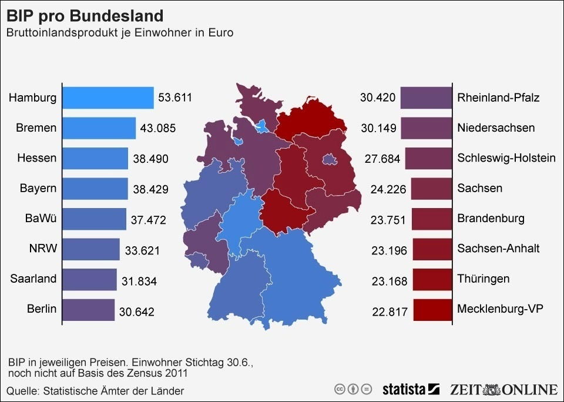
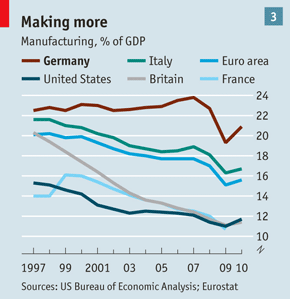
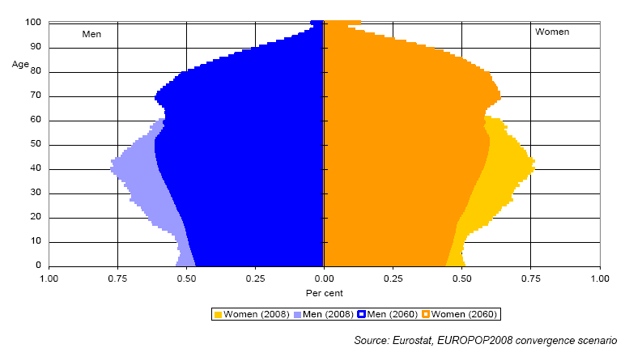
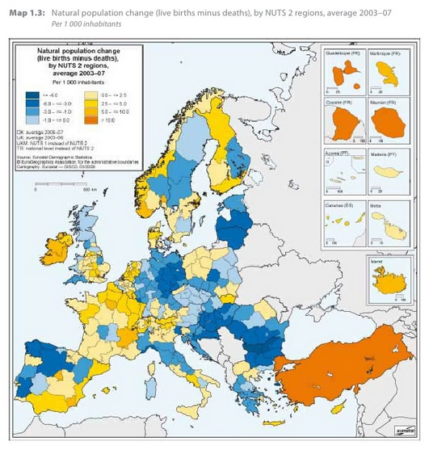
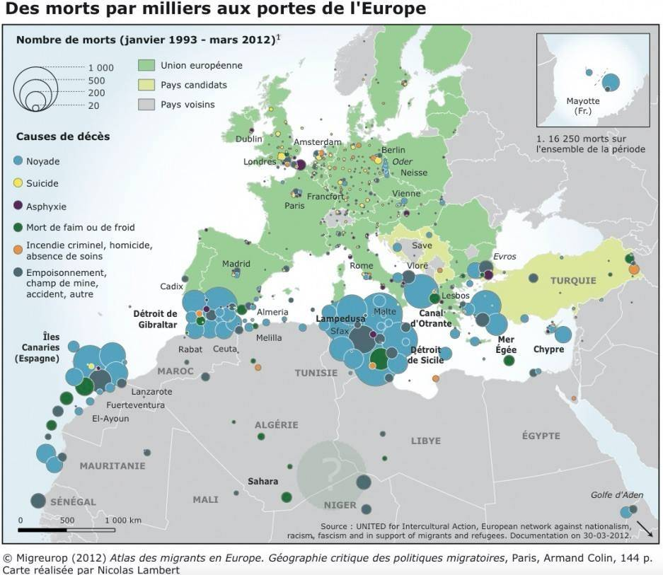
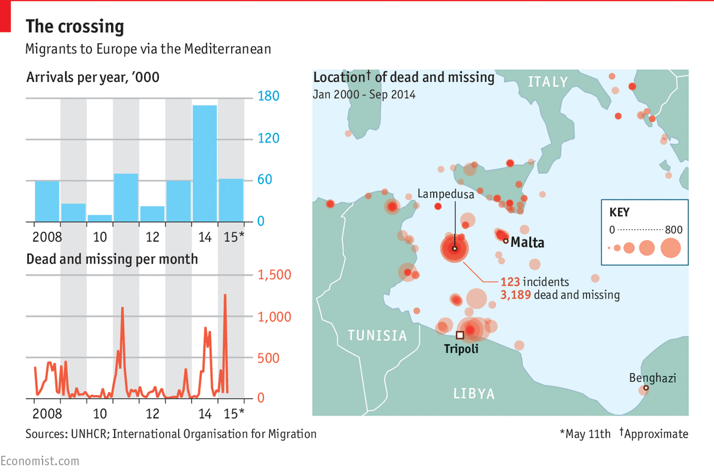

This is a weird and vast question. There is two points that I would like
to highlight to provide some more elements for an hypothetical answer : 
1) the capacity of renewal of Europe\'s own production system and 2) the
crucial role of migrants in its future political decisions.\
\
**1. Economy and production**\
Recent events in Greece have shown how unbalance is the distribution of
wealth and production means between regions of Europe.  We usually hear
that Germany itself concentrates most of the creation of value in
Europe. A closer look at the country shows us that most of the wealth is
actually located in the Southern regions, while the North and East still
largely lagging behind, suffering from high youth unemployment and very
weak local economies.\
\
*GDP repartition in
Germany\'s Lander - source : * [*Der Zeit via Al
Jazeera*](http://america.aljazeera.com/opinions/2014/11/germany-berlin-wallfallunificationeconomics.html)\
\
Actually, the \"German miracle\" of the Mittelstand becomes more
coherent when you look at the whole Central region of Europe. The
closest neighbors named Switzerland, Holland, Austria and Northern Italy
are doing very well and it may have help. This part is also
traditionally the most populated region of Europe.  \
\
*Source :* [*ESPON -
September
2011*](http://www.espon.eu/main/Menu_Publications/Menu_MapsOfTheMonth/map1103.html)
\
\
Fact is, this distribution of wealth reflects almost exactly the map of
the European industry.\
\
[GDP and Productivity
in Europe
(2006)](http://www.nordregio.se/en/Maps--Graphs/03-Economy-trade-and-industry/GDP-and-Productivity-in-Europe-2006/)
*- source : Nord Regio*\
\
This last map is from 2006, and things have changed quite a bit since,
following the numerous relocation during the last 10 years.
Manufacturing especially has gradually disappear from the landscape
(except for Germany). Most of the factories have moved to China - and
now surely to Bangladesh or Myanmar.\
\
*Evolution of
manufacturing (as % of GDP) - Source :* [*The
Economist*](http://www.economist.com/node/21552567)\
\
Now that we have a grasp of the geo-economic situation, there is one
more thing that we need to look at. There is new players arriving
recently in the job market. They are efficient, cheap and silent ; they
don\'t sleep or eat and they do what they are told : here come the
robots !\
\
They have been replacing workers in factories for decades and the trend
is not there to change. According to[a recent
study](http://www.reuters.com/article/2015/02/10/us-manufacturers-robots-idUSKBN0LE00720150210),
they should even get 22% cheaper between now and 2025. For electronics
manufacturing in China, they are already cheaper than actual workers.
And don\'t think this will affect only assembly lines. They are now
entering many sectors of the job market. [Another
study](http://www.businessinsider.com/jobs-replaced-by-robots-2015-5#ixzz3gT7ebNH4)
shows that : *\"Many service, sales, and administrative jobs are at
risk\"* while *\"occupational therapists, surgeons, choreographers,
pre-school teachers, and clergy\"* will stay out of trouble for some
more years. \
\
*source :* [*Business
Insider*](http://www.businessinsider.com/jobs-replaced-by-robots-2015-5#ixzz3gT7ebNH4)\
\
The question behind this is : how will Europe position itself towards
this new trend ? Trying to pursue a path towards 10% growth while you
have half of the population unemployed looks like a weird thing to do.
The universal income seems the only thing feasible to sustain
consumption, but it still a remote idea from the far-left so far.
Discourse about re-industrialization and how to bring back old factories
seem completely out of step. Instead, how can diversified territories
define their aims and specialized in their own strengths ? So far, it
doesn\'t seem like ordoliberalism can work anywhere except in the Center
Europe. \
\
**2. Migration and population**\
The other very urgent problem is of course the aging population. If
Europe wants to have millions of lumbersexuals growth-hackers coming on
their fixies to design the next generation of cost-efficient robots and
automates, the continent will need first to bring some youth to its
gentrified suburbs.\
Following the
negative renewal rate of the population in the center of Europe, we can
except the traditional industry to simply dies out from its old age. At
almost -4% a year in certain region, this will be a long agony.\
\
\
One of the classical approach to the demographic problem of an aging
population is to open the gates to migrants, so they can come and bring
their families and hopes to build a younger and more active society.
Migrants usually bet their own lifes on the trip to their host country
so they are pretty serious about doing things well after. Nevertheless,
the institutions from the European Union has taken a completely opposite
stance, since they have started built armed fences all around the
borders of Europe.\
\
While this is not preventing people from Africa and the Middle East from
coming, the result of those policies have been catastrophic on every
level. By forbidding thousands of migrants to have a regular
administrative presence, it has pushed a very large group of people
(about 6 million from[a recent
study](http://www.ohchr.org/Documents/HRBodies/CMW/Discussions/2013/DGDMigrationData_PICUM_2013.pdf))
to live completely out of the European society on its own territory. It
has also created great discords between the members of the EU since the
Dublin regulation has forced the country of arrival to deal alone with
its migrants, cornering Greece, Spain and Italy in an untenable
position. Every day, thousands of people are still coming and hundreds
of them are dying weekly in their attempt to cross the Mediterranean
sea. No doubt that history will remember today\'s immigration policies
has one of the darkest political move of Europe in the 21st century.\
 \
Map of the deaths
at the gates of Europe *- Source : Migreurop*\
\
Part of the province of Sicilia, the island of Lampeduza is in the top
25 of the best beaches in the world on Trip Advisor. This is also the
closest European landfall for the boats coming from Northern Africa.
Every hour, people are reaching the shores of the old continent after
months of an apocalyptic journey towards a better life. What they get is
scared tourists and a bunch of cops and journalists that are waiting for
them. In 2014, 170,100 people arrived on this beach by the sea. The law
requires to stock them in camps, waiting for a decision about their
\"administrative\" crime of not having papers. The flow is so intense
that are usually directly set free to keep going on the roads of Italy
without any right.\
\
*Source :* [*The
Economist*](http://www.economist.com/blogs/graphicdetail/2015/05/graphics)\
\
As the French journalist Edwy Plenel recently said in an interview,
Europe should turn Lampeduza into a new Ellis Island and welcome all
those people that have risked their life to come here. They actually
don\'t except much and Europe could give them a fresh start on its land.
The future of Europe, its demography, economy, culture and politics is
tied irremediably to those people that have come and still arriving.
They are here to stay and we Europeans are throwing them in camps, like
in Calais in France near the border with the UK. By hurting them,
countries of Europe are hurting their own future. Do we want to be again
the worst sort of evil racists secretly dreaming to yet another
extermination plan ? Or do we want to seize this gigantic opportunity to
build an union based on the values we inherited from our peers ?\
\
After slavery, colonies and the world wars of the 20th Century, the fate
of those people will set the face of the continent for the next century.
There still an actual window for choice that should be seized, even
though actual governments won\'t budge by fear to lose points in their
electorate. Actually they are already moving for years, but in a
completely wrong direction.
