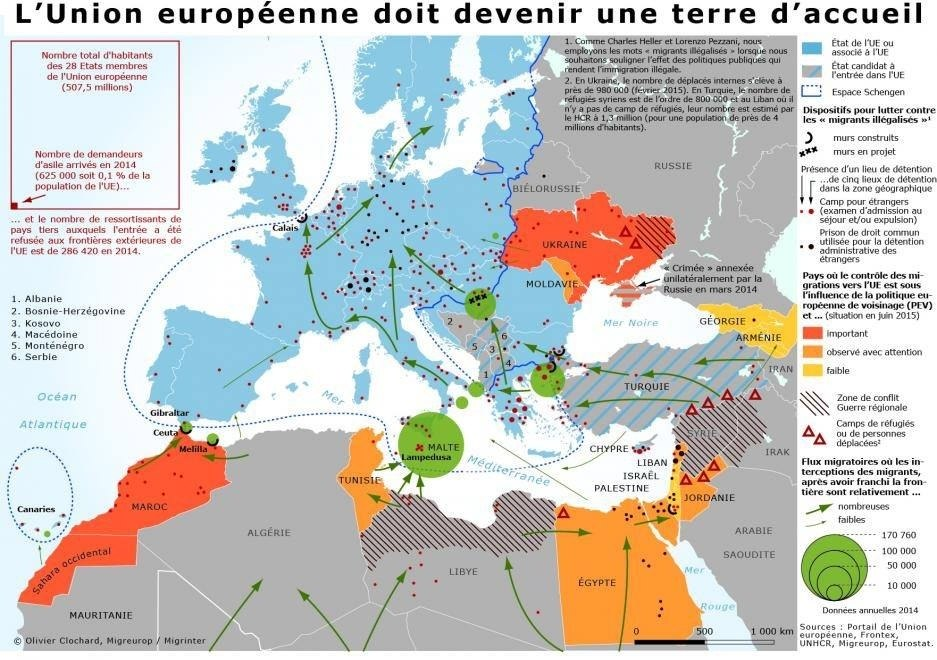
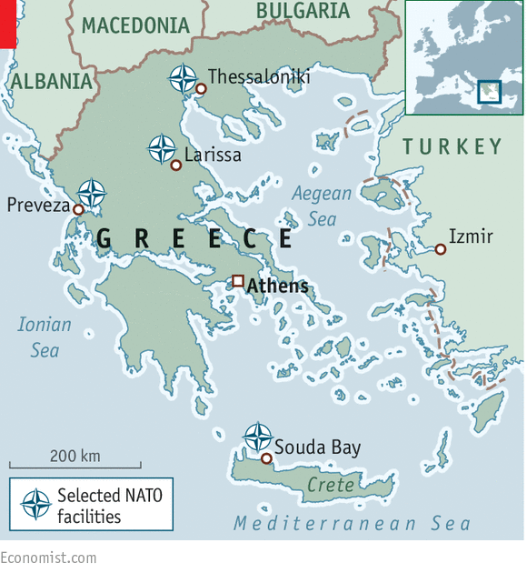
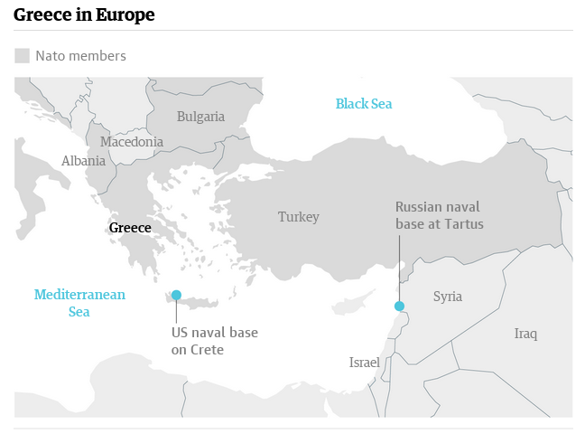
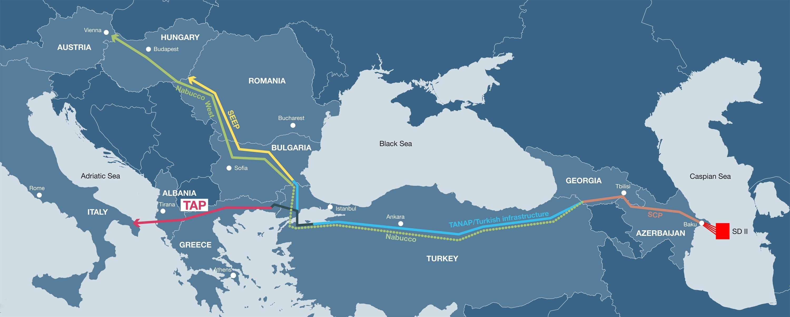

Just to add a complementary point of view, because most of the answers
here focus on Eu\'s fear of economic crisis contagion to other
peripheral or Southern states. \
\
**EU can not eject Greece because it is its Orient doorkeeper.**\
\
Historically, it has often been. EU needs to keep Greece for different
reasons : 1) contain immigration in peripheral states and 2) provide
strategic defense basis in the Eastern Mediterranean sea.\
\
\
**The EU policy on immigraion depends on Italy and Greece** - and
outside the EU Turkey and Libya. Libya and Turkey got a substantial
amount of money from the EU to contain immigration and park migrants in
camps \[1,2\].  Greece is the next nation on the map and therefore a
very crucial piece of the puzzle to implement EU immigration policies -
basically prevent migrants to reach France, UK and Germany. Like
Bulgaria, Greece had to build walls and fences at its border in order to
keep receiving help from the EU \[3, 4\].\
\
On a side note, the new Siriza government in Greece has voted to tear
down the walls, which is one very bold move against EU core policies
\[5\]. This is the first state in the EU to act publicly against the
racist and inhuman migration policies that have lead to the deaths of so
much people trying to reach the EU during the last decade.\
\
*Map of migrations
in Europe* - from Migreurop\
\
**Greece is of the highest strategic importance for the defense plan of
the EU.**\
\
One other main reason for keeping Greece in the EU at any price is the
crucial strategic importance of Greece in the Eastern Mediterranean
region. From a very schematic look at history, you could say that Greece
has been the place where Arabic and Persian armies fight the European
ones. Despite political turmoil of the last decades, Greece have kept a
quite modern and powerful army \[6\], which represents a key assets for
NATO.\
\
 source : [The
Economist](http://www.economist.com/news/europe/21645254-america-much-more-europe-sees-strategic-stakes-aegean-semi-guided-missile)\
\
Bases from Russia and the US are just a few kilometers from it coasts.\
\
source : [The
Guardian](http://www.theguardian.com/world/2015/jul/10/greece-euro-drama-geopolitical-concerns-europe-eu)\
\
**Greece is on the road map for important energy projects going from
Eastern regions to the EU.**\
\
Finally, energy projects are of course of crucial interest for EU
members, especially the trans-adriatic pipeline \[7\] which will bring
gas from the Caspian sea to Europe. This is an important friction point
with Russia - it provides an alternate route to avoid the gas going
through Ukraine.\
\
source : [Oil & Gas
Mediterranean](http://www.oilandgascyprus.com/?p=104)\
\
So, despite the common currency and economic reasons, there is also real
strategical reasons for the EU to keep Greece very close.\

------------------------------------------------------------------------

\
\[1\] [Libya Detention Profile -
Introduction](http://www.globaldetentionproject.org/countries/africa/libya/introduction.html)\
\[2\] [Turkey - the Demographic-Economic Framework of Migration - from
EU Migration Policy
Centre](http://www.migrationpolicycentre.eu/docs/migration_profiles/Turkey.pdf)\
\[3\] [Is Bulgaria's border wall forcing migrants to risk deadly
crossings?](http://www.euronews.com/2015/04/30/is-bulgarias-border-wall-forcing-migrants-to-risk-perilous-sea-crossings/)\
\[4\] [Greece builds wall to stop illegal
migrants](http://sputniknews.com/voiceofrussia/2014_01_23/Greece-builds-wall-to-stop-illegal-migrants-7991/)\
\[5\] [EUROPE - Syriza's Turkish deputies vow to 'tear down wall' in
Thrace](http://www.hurriyetdailynews.com/syrizas-turkish-deputies-vow-to-tear-down-wall-in-thrace.aspx?NID=78755&NewsCatID=351&PageID=238)\
\[6\] [2015 Greece Military
Strength](http://www.globalfirepower.com/country-military-strength-detail.asp?country_id=greece)\
\[7\] [Trans-Adriatic Pipeline Deal: Does European Union, Azerbaijan
Agreement Undermine Russian Energy
Plans?](http://www.ibtimes.com/trans-adriatic-pipeline-deal-does-european-union-azerbaijan-agreement-undermine-2019959)
