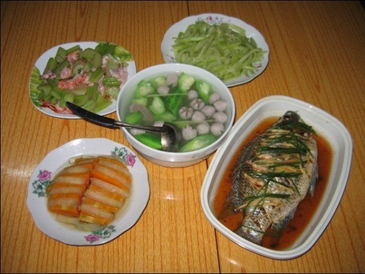
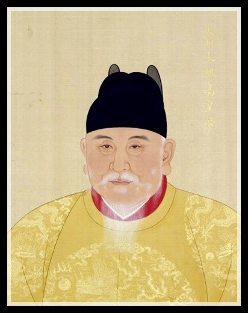
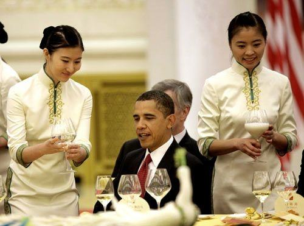
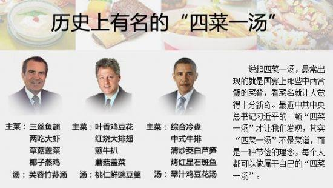
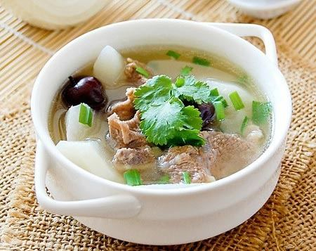
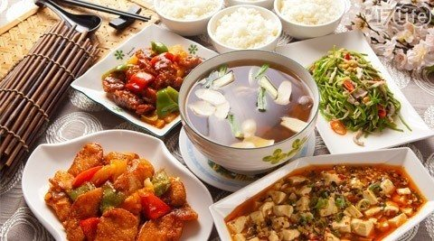

One of the most traditional form of Chinese meal is made of \"*four
dishes and one soup*\"  (四菜一汤). \
\
​\
\
**The legend**\
 \
This tradition originates in the early days of the Ming Dynasty, under
the reign of the emperor Zhu Yuanzhang. Originally a peasant, Zhu
Yuanzhang has lead the revolt that forced the Yuan dynasty to retreat,
becoming Ming Hongwu, the first emperor of the Ming dynasty. \
\
​\
*Zhu Yuanzhang, first emperor of the Ming dinasty*\
\
Under his reign, the country regained prosperity but its people still
suffered from famine. For merchants and officials, the life was good
tough and they were hosting the most extravagant banquets. Zhu
Yuanzhang, who had beg for food in his youth, was particularly upset
with what he saw as a highly corrupted lifestyle. The birthday of its
queen was approaching, so he decided to host a big party and invite all
the lords from the Middle Kingdom.\
\
Once everyone has arrived, he stood up and said :   *\"For this very
special meal, there will be only four dishes and one soup : the first
dish will be stir-fried radish, the second dish will be stir-fried leek,
then you will be served two small bowls of vegetables and a Tofu
soup.\" * Everyone was absolutely surprised, as they were expecting
bird\'s nest and other legendary dishes from the royal kitchen. Those
were the most basic dishes, without even any meat.\
\
Zhu contiues his speech, saying that officials should be *\"like the
moon and the sun\"* and live out green vegetables (青菜). \[1\] As usual
in Chinese, there were a second meaning to his words : the Chinese word
for green (*qing*) vegetables also meant being upright and virtuous for
an official (清官). Serving this meal to the lords of the country was
the equivalent of announcing the beginning of a large campaign against
corruption.\
\
**The standard** **** **meal**\
\
Since then, the \"*four dishes and a soup\"* is the symbol of a frugal
but luxurious meal - an extreme form of sophistication ! The communist
regime has brought back this legend since 1949 and it has even become
the official meal for state banquet when receiving foreign presidents.
When Obama came in 2009, he had 1) cold dishes , 2)  Chinese-flavored
beef, 3) steer-fried wild rice and bamboo sprouts and 4) grilled groper
+ a tofu chicken soup. \[2\]\
\
​\
*Obama having its four dishes and a soup in Peking.*\
\
​\
*Each US president had its own specific menu.*\
\
This is so popular that it has become ubiquitous in advertisements for
food. I live in France, and recently some friends\'s families came from
China to visit Europe. They were enthusiastic and told me how great
their trip has been so far : *\"We had* **six** *dishes and a soup
everyday !\".* The only downside is that it was all Chinese food, so
they didn\'t get to taste the French food really. Even the restaurant
inside the Eiffel Tower served them *\"four dishes and a soup\".*\
\
\
**The actual meal**\
\
The soup plays a very important role in Chinese cuisine. You usually
don\'t have water on the table during Chinese family dinners
(restaurants usually provide water or tea tough). The most basic soup is
made from tomato and eggs, but it can become really elaborated with rare
things like fish head or black chicken. The soup will usually be served
first, prior to any other warm dishes.  Its role is to warm your stomach
up and help you quench the thirst and hunger, so you can slowly enjoy
the rest of the meal.\
\
​\
\
The rest of the dishes may vary according to regions, restaurant,
families, tastes and so on, so there is almost infinite possibility to
combine dishes. The most typical thing will be one fish, one meat and
two vegetables. Also, you can select between the different tastes : one
sweeter, one saltier, one spicier, etc. In Northern China, the food is 
usually more salty, while people from the center eat really spicy. The
Southerners like *\"bland\"* food, which is seen as a positive quality
of being tasty without being strong.\
\
​\
\
\
As a French, I have an eternal respect for the Chinese cuisine. I have
to stop writing now tough, because I am salivating too much.\
\
\[1\] Baidupedia
[四菜一汤\_百度百科](http://baike.baidu.com/view/21842.htm)\
\[2\] People\'s Daily 
[http://opinion.people.com.cn/GB/\...](http://opinion.people.com.cn/GB/1036/10419965.html)
