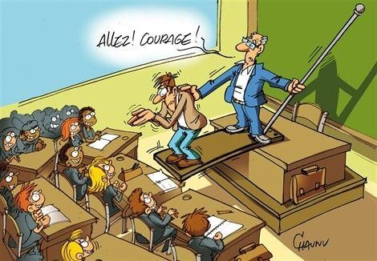

The show is interesting and entertaining to watch. Sadly, it sacrifices
the debate on education to wave national flags and compare \"cultures\"
for the sake of entertainment. Still, it makes a good point of showing
how discipline may be an undervalued component of Western education, and
also how hard it is to manage a class today with traditional methods.\
\
***China and Britain have different purposes in educating***\
\
Regarding the \"*Chinese way to educate*\" that this TV show is trying
to discuss, I don\'t think it really exist. The way teachers approach
the classrooms and the topics are not that different from what my
parents experienced in France during the 50\'s. Different time and place
produce different societies, and therefore requires different
preparation to live in, i.e. education systems. Definition of education
systems are choices that determines the future of a society. China has
chosen a nation-state model based on intensive production, and therefore
produced an education system to support this plan. As things are
changing so fast there, the education system looks painfully slow and
mostly failed to deliver children with the skills required to success in
the transition the country is experimenting right now. For that reason,
millions of Chinese go abroad to study skills like work group,
self-reliance, constructive feedback, etc. Companies in China also love
to hire returnees for this reason. This BBC show is a good example of
the contrast in purposes between British and Chinese education.\
\
source : [For Wealthy
Chinese Students, Studying Abroad Becomes the
Norm](http://awesome.good.is/transparency/web/1205/export-of-students/flat.html)\
\
This failure of education system to adapt is not typical of China. A
good school should prepare you for the day you will actually enter the
job market, that is one or two decades *after* the class. Then,
education is such a conservative institution that it takes ages to
integrate even the current changes. France or UK fail to prepare their
students to a multilingual world while having all the human resources to
achieve it quite easily. Education systems are expressions of historical
and political processes, and this BBC show is all about setting up an
ideological stage to play the failure of Chinese political system as a
farce .\
\
\
***Europe : from child labor to \"liberal\" education***\
\
In England of the 19th Century, most textile factory were designing
machines to be used by children because their labor was cheaper. Fierce
debates started in England between those who saw children as the way to
grow a bigger working class and those who argued that having children
work so early was hurting the future of the nation :\
\

> The tendency of the various improvements in machinery is to supersede
> the employment of adult males, and substitute in its place, the labour
> of children and females. What will be the effect on future
> generations, if their tender frames be subjected, without limitation
> or control, to such destructive agencies?

> \-- Lord Ashley in the [Lords Sitting of 15 March
> 1844](http://hansard.millbanksystems.com/commons/1844/mar/15/hours-of-labour-in-factories#column_1088)\

\
As [Andrew Feenberg](https://en.wikipedia.org/wiki/Andrew_Feenberg)
shows, the decision to abolish child labor turned children from
producers into consumers. It exposed new generations to knowledge and
opened opportunities for a rapid improvement of technologies. Instead of
destroying the industry like many have thought, it unleash new forms of
energy to develop it faster than ever.  At the end of the 19th century,
industrialism was all about opening elite schools to create leaders for
a new society, like Saint-Simon in France with the Arts & Métiers*.*\
\
In France, the [Certificat d\'études
primaires](https://fr.wikipedia.org/wiki/Certificat_d'%C3%A9tudes_primaires)
(CEP) was created in 1867 to test requirements in maths, reading,
applied sciences and some basic life skills for children around 11-years
old. Like in today\'s China, the level for maths of grammar was much
higher than what is in the current exam.  Mostly, students were asked to
memorize tasks and processes, and learnt how to keep still on their sit
for 10 hours a day. Before the 2nd World War, the French philosopher
Alain wrote one of the first book that claim that schools should provide
space to learn instead of training students to defined skills :\
\

> \"*If the teacher shut up and the students read, then everything is
> okay (\...)  The improvement of education itself is more important to
> grow the social well-being than the progress of instruction.\"*

\
\-- Propos sur l\'Education, 1938. Alain\
\
A more liberal approach of education only started to be considered in
the late 1960\'s, almost a century later. The French CEP was only
abolished in 1989, almost a century after its creation. Like Chinese
schools today, French and British schools until very recently were
preparing students for mostly industrial jobs characterized with a
strong work division and chain of command. New management is now asking
employees for more mobility and flexibility, changing the traditional
corporation and danwei labour division. Schools may adapt, slowly.\
\
*UX in 1902 :
machines were designed to be used by children - pictured taken in
Lancaster Cotton Mills. Nov. 30, 1908 -* source :
[NARA](https://commons.wikimedia.org/wiki/File:Sadie_Pfeifer,_48_inches_high._Has_worked_half_a_year._One_of_the_many_small_children_at_work_in_Lancaster_Cotton..._-_NARA_-_523128.jpg)\
\
***On the difficulty of being a teacher***\
The show put those Chinese teachers in difficult positions, because of a
supposed lack of discipline from the students. This is not related to
the fact the teachers are Chinese, but mainly because they are using
wrong methods for the wrong audience. This happen to hundreds of French
teachers in France, UK, etc. You arrive with a nice textbook about
literature and you find out that half of the students can barely read.
Explaining Balzac\'s lexicon to illiterate is like \"*playing harp for
cows*\" like people say in China (对牛弹琴) and won\'t get you much
results at the end. Then, if you decide to restart from Reading 101, you
will surely get a blame from the administration and push students to
fail at the exam.The most commonly adopted solution is to ignore
students that have difficulties and blaming them for being lazy, while
you are having fun with the few ones that are doing great. Real problems
only occurs when your usual speech to the first row is made impossible
by the background noise from the classroom - like in the BBC show.\
\
So, are students wrong or are you a bad teacher ? This is what you start
asking yourself when students start questioning your authority (like in
the show). In Europe, high-schools and middle-schools teachers is
actually one of the profession with the highest [suicide
rates](http://www.channel4.com/news/teachers-suicide-rates-double-in-a-year).
Honestly : students are adorable but can be really harsh, administration
will leave you isolated if problems occur, parents think you don\'t do
your job well (too much work, too less, or whatever they dislike about
you). Then, the whole society think you are some sort of lazy civil
servant that has found a quiet place to hide in his classroom.\
\
*\"Let\'s go ! Be
brave !\" \--* source : CHAUNV\
\
I remember this Chinese guy who came to teach Chinese in an association
in Paris. After a few lessons, he came to the teachers\' meeting and
announce with a very sad voice he was quitting. The reason was : even
after explaining several times, students (adults) were still
interrupting him to ask questions, so he thought he was unable to
explain things clearly. The school director explained him that in France
it was OK to ask details and further explanations, and the students were
all very happy with his lessons. It takes lots of attempts and failures
to master the art of communicating knowledge (and more) to a group of
disparate people you don\'t know. I encourage everyone to watch the
movie [The Class (2008)](http://the%20class%20%282008%29/) , which shows
a teacher handling (well) a difficult class in Paris.\
\
***Notes about discipline***\
\
In 1975, Foucault wrote an history of the penal system where he examines
the idea of discipline :\
\

> ***\"Discipline proceeds from the distribution of individuals in
> space.(\...) Discipline is an art of rank, a technique for the
> transformation of arrangements.  It individualizes bodies by a
> location that does not give them a fixed position, but distributes
> them and circulates them in a network of relations.\"***

\-- M. Foucault, 1975. [Discipline and
Punish](https://en.wikipedia.org/wiki/Discipline_and_Punish) (p.163)\
\
We can say that this part works effectively in the Chinese education
system, since the assignment of rank is its main purpose since the
[Imperial
examination](https://en.wikipedia.org/wiki/Imperial_examination) for
centuries. Apart from the ranking of schools, you have radical
differences of behaviors, expectations and results in a single classroom
between the class leader (*banzhang*), the delegates (*banganbu)* and
the rest of the students*.* They occupy different ranks defined very
clearly and usually also have very different views on their future. Read
more in my answer about :[How does promotion work within the Chinese
Communist
party?](http://quora.com/How-does-promotion-work-within-the-Chinese-Communist-party/answer/Cl%C3%A9ment-Renaud)\
\
I know from experience that the relative lack of discipline in Western
education can also become a problem later in life, because you avoid
making hard decisions that are needed because you think you don\'t have
courage to commit to it. This made me run repeatedly  into problems that
I may have avoided with stronger self-discipline. One thing I really
don\'t know is how much the discipline of obeying to a teacher can
transfer to self-discipline. People usually hate taking decisions by
themselves and love to obey orders, but does \"discipline\" help when
there is no defined rules or authority to follow ? or does it make it
even worst ? This is still an unanswered question for me today.
