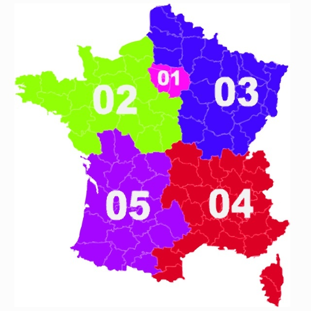

Phone numbers in France are made of 10 digits

\- the first digit is a zero.\
- the second digit express the type of number being used : 1 is Paris, 2
to 4 are landlines (divided in 4 geographical zones), 6 and 7 are mobile
numbers, 8 are \"special numbers\" (free or premium-rate number). Since
2006, 9 is used by web providers to offer landlines.\
- the rest depends on companies or numbers

ex.\
A mobile phone : 06 23 12 45 54\
A landline in Bordeaux : 05 56 10 20 30

International prefix is +33 or +590/596/594 for French overseas
departments and territories.

​

source : [Préfixes des numéros de téléphone en France
métropolitaine](http://www.commentcamarche.net/faq/29005-prefixes-des-numeros-de-telephone-en-france-metropolitaine)
