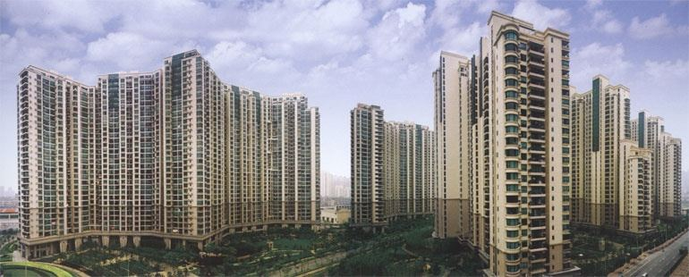

As others mentioned, nobody lives inside M50 (only art spaces and caffes
there).

Then just next to M50, you have 30+K people living in the so-called
*Brilliant City* (中远两湾城)*.* This is one of the biggest and densest
compound in Shanghai, one of the craziest urban living experiments from
the early 2000s. There is all kind of stories and flats to be found
there...

Xuhui is very diverse, so hard to say which one is better.

Source : [中远两湾城\_百度百科](http://baike.baidu.com/view/3577342.htm)
