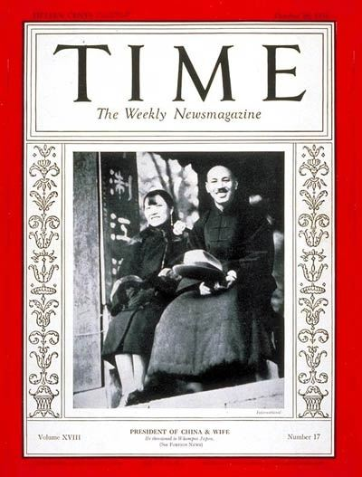

One of the most important and emblematic figure of Chinese history in
the 20th century is Song Meiling (Soon Mei-Ling), better known as
*Madame Chiang Kai-shek*.

Declared "most powerful woman in the world", her life tells the story of
the ties between the US and China, and the decades-long dream of a
westernized China that ended with Mao in 1949. Raised as a christian in
the US, she was born in one of China's most influential family at the
time that will later give birth to the "Taiwan lobby" in the US.

Her French biographer Philippe Paquet gives an incredibly well-written
and detailed account of her story. There is also several biographies in
English. I warmly recommend to read one, first to fully grasp China's
role in this very important period of recent history, and second to get
acquainted with this astonishing character.

[TIME Magazine Cover: Chiang Kai-shek & Mme. Chiang - Oct. 26,
1931](http://content.time.com/time/covers/0,16641,19311026,00.html)

Historic Archival Stock Footage WWII : China\'s First Lady Addresses
U.S. Congress (1943)
