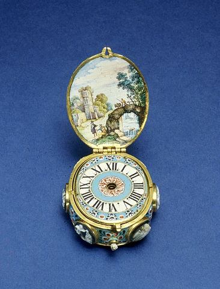
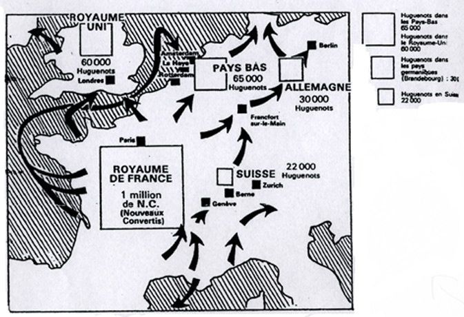
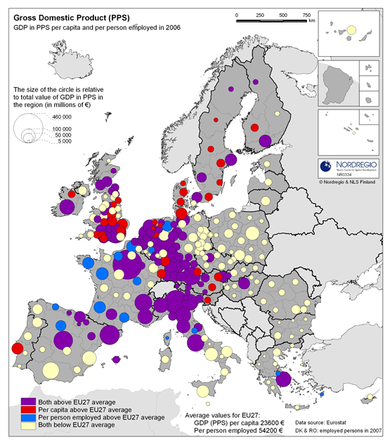

The welcoming of immigrants plays a very important role in the
prosperity of Switzerland. Voltaire, Lenin, Tzara and many others have
found in Switzerland a refuge and a place to nurture powerful ideas and
destinies. The old mountainous culture of the Alps emphasize that
hosting people in danger brings good karma. And history shows that
hospitality has largely benefit the Swiss. The most famous example is
maybe the creation of the Swiss watch industry in the 16th century by
the large incoming of French refugees fleeing protestants persecution.

Since 1540, Calvin has welcomed converts to Protestantism in its newly
created Reformed Church of Geneva. The *Huguenots* (French protestants)
has fled massively France as the Catholic king started huge campaign to
chase them. French goldsmiths and skilled craftsmen were settling in
Geneva but were out of work in a city where the new protestant ethics
forbid luxury and the display of ostentatious jewelry. Thinking about
new ways to sell their crafts, they started to design beautiful portable
clocks. These watches were tolerated for their usefulness and quickly
became a new fashion in the region.

*17th-century German Baroque style fob watch.* - source :
[Wikipedia](http://nhttps//fr.wikipedia.org/wiki/Histoire_de_l'industrie_horlog%C3%A8re#/media/File:German_-_Enameled_Watch_with_Cameo_and_Jewels_-_Walters_5811.jpg)

Fast-forward a century later. In 1685, the relative peace between
catholic and protestants is broken once again in France when Louis the
14th revoked the Edict of Nantes in an attempt to eradicate
Protestantism. More than 200 000 French protestants escape France in
what is called the "grand Refuge". Thousands of refugees arrived in
Geneva from Lyon and Paris, bringing their businesses of crafts,
printing, art and decoration. In a few years, Geneva and the provinces
nearby have became centers for crafting and designing watches. The
reputation of Swiss watches spread all over Europe. The rest is history.

*Map of French protestants exodus during the "Grand Refuge" under Louis
14th -* (c) [Musée du
Désert](https://www.museeprotestant.org/notice/le-refuge-huguenot/)

As Peter's answer describes well, Switzerland has always benefit from
being a "border country" within the Alps. It stands at the center of
what still today one of the most dynamic region of Europe (between
Southern Germany, Northern Italy, Eastern Austria and the Rhone valley
in France). The strength of Switzerland largely come from its uncanny
ability of opening its door to outside influences and flows.

The country itself is a political miracle : German, French and Italians
living together on the same land for centuries- sounds totally
incredible. The federal and political structure of frequent elections
force people to take decisions together frequently, learning to
compromise and live together. Switzerland don't take people and
relationships lightly. They understand that prosperity is made by people
and that, ultimately, what matter is not where they come from but
who/what they are.

[GDP and Productivity in Europe
(2006)](http://www.nordregio.se/en/Maps--Graphs/03-Economy-trade-and-industry/GDP-and-Productivity-in-Europe-2006/)
*- source : Nord Regio*
