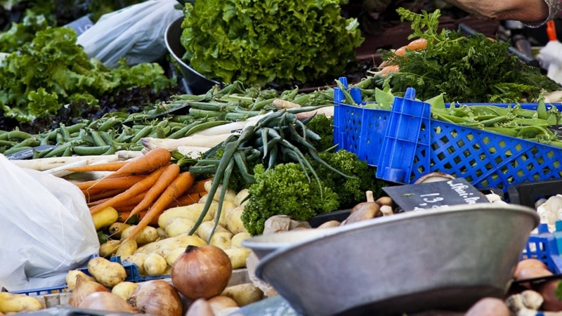
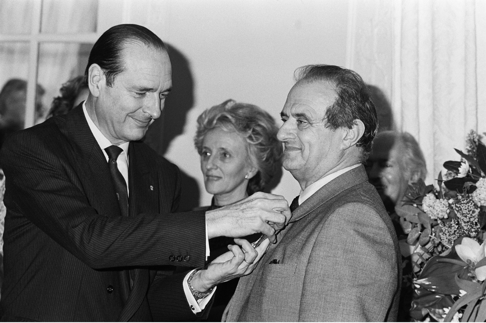

**You rarely see French restaurants abroad because "French cuisine"
nurture rarity to preserve his luxurious image.**

Here is why.

**French cuisine in France**

The secret of French food is not about recipes. Everything is about
*fresh products*. All the rest is over-rated marketing designed towards
export.

I live in Lyon.

I have a fresh market everyday here.

What can I buy?

-   Fruits and Vegetable from the South (Ardeche / Drome / Provence)
-   Cheese and dairy from the East (the Alps / Savoy)
-   Cheese, fruits and dairy from the West (Auvergne)
-   Beef from the North (Charolais / Dijon)
-   Wine from all around (Bourgogne / Macon / etc)
-   etc.

The thing is : we do not "import" from these places because it is so
close.

Farmers drive their trucks every morning to a small square next to my
place and *directly* sell their products. I got to buy strawberries,
cherries or radish that have been picked less than 4 hours ago. Nothing
can beat that taste.

*Map : The Agriculture in Rhône-Alpes region around Lyon*

If you are a chef in Lyon, you know the producers. They are your friends
and business partners. As long as you pay them, they will just keep
delivering the best products directly to your shop because they *grow*
them.

Most of these products does not exist together in another place in the
world --- which is the real luxury here. This is very difficult to
export so the focus has been switched to the sophistication of craft and
presentation to make your plate looks like a million dollar. It gets
very expensive because you have to import all those products from
somewhere when they don't grow locally.

**The export of "French Cuisine"**

This over-sophistication of French cuisine today has been engineered by
strategists in the 1950s that wanted to create a luxury market in the
food sector. Paul Bocuse, the famous chef from Lyon, was the initiator
of this trend. He started high-end restaurants, tours, schools, tv
shows, etc with full support from the government as part of France
cultural diplomacy.

*Chirac giving to Paul Bocuse the "Légion d'Honneur", highest French
order of merit for military and civil merits.*

Traditional French cooking is NOT more complicated than anywhere else.
Just climate in France is gentle and most things grow well. The
sophistication evolved from the intention to make it luxurious. Again,
luxury food is just a very small part of French cuisine in France, but
it is everything abroad.

**French restaurants abroad**

The consequence fo all this is that, instead of having restaurants
abroad that serves typical French food, you end up now with expensive
tables labelled as "French cuisine". As a French that lived in several
other countries, I usually avoid these tables because they always leaves
me with a bad taste at the end --- either because of the food, the bill,
or both.

Most French restaurant position themselves as "luxurious", which is a
much smaller market than let's say pizza or pasta.

That is why you don't see so much French restaurants around you but you
keep hearing about the French cuisine.

That is also why I live in Lyon because food *is* life, despite what
some people say :-)
